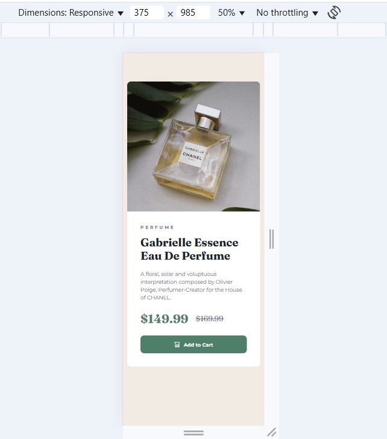

# Frontend Mentor - Product preview card component solution

This is a solution to the [Product preview card component challenge on Frontend Mentor](https://www.frontendmentor.io/challenges/product-preview-card-component-GO7UmttRfa).

## Table of contents

- [Overview](#overview)
  - [Screenshot](#screenshot)
  - [Links](#links)
- [My process](#my-process)
  - [Built with](#built-with)
  - [What I learned](#what-i-learned)

## Overview

### Screenshot

### Links

- Solution URL: [Add solution URL here](https://your-solution-url.com)
- Live Site URL: [Add live site URL here](https://your-live-site-url.com)

## My process

### Built with

- Semantic HTML5 markup
- CSS custom properties
- Flexbox
- CSS Grid

### What I learned

# Front-end Style Guide

## Layout

The designs were created to the following widths:

- Mobile: 375px
- Desktop: 1440px

## Colors

### Primary

- Green 500: hsl(158, 36%, 37%)
- Green 700: hsl(158, 42%, 18%)

### Neutral

- Black: hsl(212, 21%, 14%)
- Grey: hsl(228, 12%, 48%)
- Cream: hsl(30, 38%, 92%)
- White: hsl(0, 0%, 100%)

## Typography

### Body Copy

- Font size (paragraph): 14px

### Font

- Family: [Montserrat](https://fonts.google.com/specimen/Montserrat)
- Weights: 500, 700

- Family: [Fraunces](https://fonts.google.com/specimen/Fraunces)
- Weights: 700
